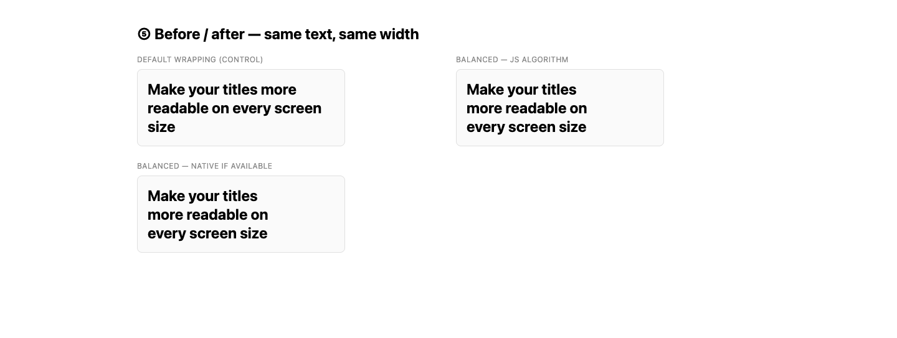

# wrap-balancer (vanilla)

> A dependency-free, framework-free port of [**react-wrap-balancer**](https://github.com/shuding/react-wrap-balancer). Drop one `<script>` tag onto any plain HTML page and your titles stop dropping a single lonely word onto the last line.

🇰🇷 한국어 문서: [README.ko.md](./README.ko.md)



The core binary-search algorithm (`relayout`) is **ported verbatim** from react-wrap-balancer (MIT © Shu Ding). This package only re-implements the parts React used to provide — unique id generation, inline styling, native feature detection, "re-balance on content change", and observer cleanup — so it can run with no build step and no framework.

- ✅ **~3.8 KB minified**, zero dependencies
- ✅ Works with a plain `<script>` tag → exposes a global `WrapBalancer` (UMD)
- ✅ Auto-initialises `[data-br-balance]` elements; also a small programmatic API
- ✅ Uses native CSS `text-wrap: balance` when available, JS binary-search otherwise
- ✅ Re-balances on container resize (`ResizeObserver`) and content change (`MutationObserver`)
- ✅ **Proven byte-identical** to the React original across 504 randomized cases — see [Equivalence & testing](#equivalence--testing)

---

## The problem

When a heading wraps, the browser greedily fills each line, which often leaves a single word stranded on the last line:

```
Make your titles more
readable on every screen
size                          ← lonely orphan
```

Balancing redistributes the words so every line is roughly equal width:

```
Make your titles
more readable on
every screen size             ← balanced
```

---

## Install

### Option A — `<script>` tag (recommended for plain HTML pages)

Copy `wrap-balancer.min.js` next to your HTML and include it:

```html
<script src="wrap-balancer.min.js"></script>
```

Or load it from a CDN that serves the fork (jsDelivr mirrors GitHub):

```html
<script src="https://cdn.jsdelivr.net/gh/Mineru98/react-wrap-balancer@vanilla-js/vanilla/wrap-balancer.min.js"></script>
```

### Option B — ES module / bundler

The UMD file also exposes `module.exports`, so bundlers can import it:

```js
import WrapBalancer from './wrap-balancer.js'
WrapBalancer.balance('.title')
```

For native `<script type="module">`, the file attaches the global as a side effect:

```html
<script type="module">
  import './wrap-balancer.js'
  WrapBalancer.balance('.title')
</script>
```

---

## Quick start (no JavaScript to write)

Add `data-br-balance` to any text element. The script balances it on load, after web fonts settle, and on every resize:

```html
<h1 data-br-balance>The quick brown fox jumps over the lazy dog tonight</h1>

<script src="wrap-balancer.min.js"></script>
```

That's the whole integration. See [`examples/01-quickstart.html`](./examples/01-quickstart.html).

> **Tip — where to put the marker.** Put `data-br-balance` on the element that *contains* the text (e.g. the `<h1>`). The library wraps that element's children in an inline-block `<span>` and balances the span inside it — structurally identical to `<h1><Balancer>…</Balancer></h1>` in React.

---

## Usage patterns

| Pattern | File |
|---|---|
| Zero-JS auto-init | [`examples/01-quickstart.html`](./examples/01-quickstart.html) |
| Programmatic API | [`examples/02-programmatic.html`](./examples/02-programmatic.html) |
| Balance ratio slider | [`examples/03-ratio.html`](./examples/03-ratio.html) |
| Dynamic content | [`examples/04-dynamic.html`](./examples/04-dynamic.html) |
| Before / after comparison | [`examples/05-comparison.html`](./examples/05-comparison.html) |

### Programmatic

Disable auto-init via `data-auto="false"` and drive it yourself:

```html
<script src="wrap-balancer.min.js" data-auto="false"></script>
<script>
  const handles = WrapBalancer.balance('.title', { ratio: 1, preferNative: true })
  // handles[0].rebalance()
  // handles[0].destroy()
</script>
```

### Per-element options via data attributes

```html
<h1 data-br-balance data-br-ratio="0.75" data-br-prefer-native="false">…</h1>
```

---

## API

The global `WrapBalancer` object:

### `WrapBalancer.balance(target, options?) → handle[]`

Balance one or many elements. `target` is a CSS selector string, an `Element`, a `NodeList`, or an array of elements. Idempotent — calling it again on the same element just updates options and re-balances (no double-wrapping). Returns an array of [handles](#handle).

```js
WrapBalancer.balance('h1.title')
WrapBalancer.balance(document.querySelector('#hero'), { ratio: 0.5 })
WrapBalancer.balance(document.querySelectorAll('.card h2'))
```

### `WrapBalancer.balanceAll(options?) → handle[]`

Balance every element matching the selector (default `[data-br-balance]`).

```js
WrapBalancer.balanceAll()
WrapBalancer.balanceAll({ selector: '.balance-me', ratio: 1 })
```

### `WrapBalancer.rebalanceAll(selector?)`

Re-run the balance on all currently-managed elements (e.g. after a layout change the observers can't see).

### `WrapBalancer.isNativeSupported() → boolean`

`true` if the browser supports native CSS `text-wrap: balance` (cached).

### `WrapBalancer.relayout(id, ratio, wrapper)`

The low-level algorithm, ported verbatim from react-wrap-balancer. You normally don't call this directly; `balance()` calls it for you.

### Options

| Option | Type | Default | Description |
|---|---|---|---|
| `ratio` | `number` (0–1) | `1` | `0` = browser default, `1` = fully compact balance. |
| `preferNative` | `boolean` | `true` | Use native CSS `text-wrap: balance` when supported and skip the JS path. |
| `wrap` | `boolean` | `true` | `true`: wrap the element's children in an inline-block span (element = container). `false`: treat the element itself as the wrapper (its parent = container). |
| `selector` | `string` | `[data-br-balance]` | (`balanceAll` only) which elements to balance. |

### Data attributes

| Attribute | Maps to |
|---|---|
| `data-br-balance` | marks an element for auto-init |
| `data-br-ratio="0.5"` | `ratio` |
| `data-br-prefer-native="false"` | `preferNative` |
| `data-br-wrap="false"` | `wrap` |
| `data-auto="false"` *(on the `<script>` tag)* | disable auto-init entirely |

### Handle

`balance()` returns one handle per element:

```ts
{
  element,        // the element you targeted (the container)
  wrapper,        // the inline-block <span> that gets max-width tuned
  id,             // generated data-br id
  ratio, preferNative, usingNative,
  rebalance(),    // recompute now
  destroy(),      // disconnect observers, clear max-width
}
```

---

## How it works

1. **Wrap.** The targeted element's children are moved into an inline-block `<span>` (the *wrapper*). The element becomes the *container*.
2. **Binary search.** `relayout` shrinks the wrapper's `max-width` via binary search to the **narrowest width that does not add any line** (i.e. keeps `container.clientHeight` constant). The `ratio` then interpolates between that compact width and the full container width.
3. **Stay balanced.** A `ResizeObserver` on the container re-balances on resize; a `MutationObserver` on the wrapper re-balances when the text changes.
4. **Native first.** If `preferNative` is on and the browser supports `text-wrap: balance`, the JS is skipped entirely and the browser does the work in CSS.

The algorithm is **deterministic**: for an identical container width, text, and ratio it always produces the identical `max-width`. That property is what makes byte-for-byte equivalence with the React original testable.

---

## Coming from react-wrap-balancer?

| react-wrap-balancer (React) | wrap-balancer (vanilla) |
|---|---|
| `<Balancer>text</Balancer>` | `<h1 data-br-balance>text</h1>` or `WrapBalancer.balance(el)` |
| `ratio` prop | `ratio` option / `data-br-ratio` |
| `preferNative` prop | `preferNative` option / `data-br-prefer-native` |
| `as` prop | use whatever tag you like; pass `wrap:false` to balance it directly |
| `<Provider>` | not needed — there is a single global |
| `nonce` prop | not needed — no inline script is injected at runtime |
| re-balance on `children` change | `MutationObserver` (automatic) |
| unmount cleanup | `handle.destroy()` |

The wrapper inline styles (`display:inline-block; vertical-align:top; text-decoration:inherit; text-wrap:…`) and the `data-br` / `data-brr` attributes match what react-wrap-balancer emits, so both produce the same *shape* of DOM.

> **SSR interop (read this if you mix both).** react-wrap-balancer's server-rendered markup already balances itself through its own embedded inline `<script>` (it defines `self.__wrap_b` and calls it) — so it does **not** need this library, and this library does **not** adopt those `data-br` spans (auto-init targets `[data-br-balance]`, not `data-br`, and never defines `self.__wrap_b`). The two are compatible in spirit but **not wire-compatible at runtime**: pick one per element. There is no crash if both are present — they simply ignore each other.

---

## Equivalence & testing

Because `relayout` is deterministic, equivalence is **provable**, not hand-waved. The harness in [`test/equivalence.html`](./test/equivalence.html) feeds byte-identical DOM to:

- the **original** react-wrap-balancer `relayout` (transcribed 1:1 from `src/index.tsx`), and
- the **vanilla** `WrapBalancer.relayout` / high-level `balance()`,

across 7 container widths × 5 ratios × many randomized titles, and asserts the resulting `max-width` is **byte-identical**.

**Result: 504 / 504 cases identical.** See the rubric in [`test/rubric.md`](./test/rubric.md) for the full equivalence criteria.

Run it locally:

```bash
cd vanilla
python3 -m http.server 8771
# open http://localhost:8771/test/equivalence.html — the banner shows PASS/FAIL,
# and window.__RESULTS__ holds the machine-readable summary.
```

---

## Browser support

Same as react-wrap-balancer. The JS path needs `ResizeObserver`:

| Chrome/Edge | Safari | Firefox | Opera |
|:---:|:---:|:---:|:---:|
| 64+ | 13.1+ | 69+ | 51+ |

Browsers with native `text-wrap: balance` skip the JS entirely (when `preferNative` is on). For older browsers, add a [`ResizeObserver` polyfill](https://github.com/que-etc/resize-observer-polyfill).

---

## License

MIT. Core algorithm © [Shu Ding](https://github.com/shuding) (react-wrap-balancer). Vanilla port maintained in this fork.
